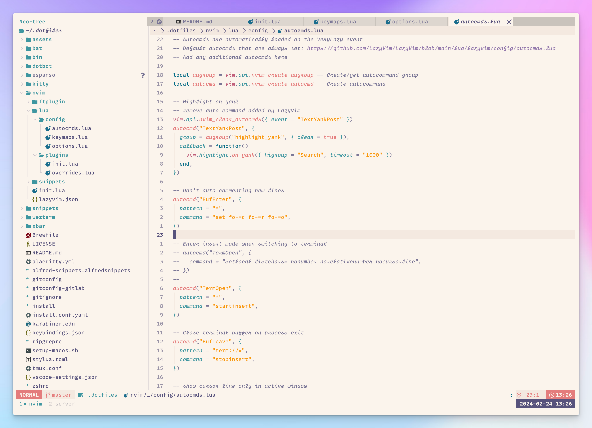

# Ammar's dotfiles

## Installation

1. `/bin/bash -c "$(curl -fsSL https://raw.githubusercontent.com/Homebrew/install/HEAD/install.sh)"`
2. `git clone git@github.com:AmmarCodes/dotfiles.git ~/.dotfiles`
3. `cd ~/.dotfiles && ./install`

I try to keep my [/uses](https://ammar.codes/uses) page up to date.
