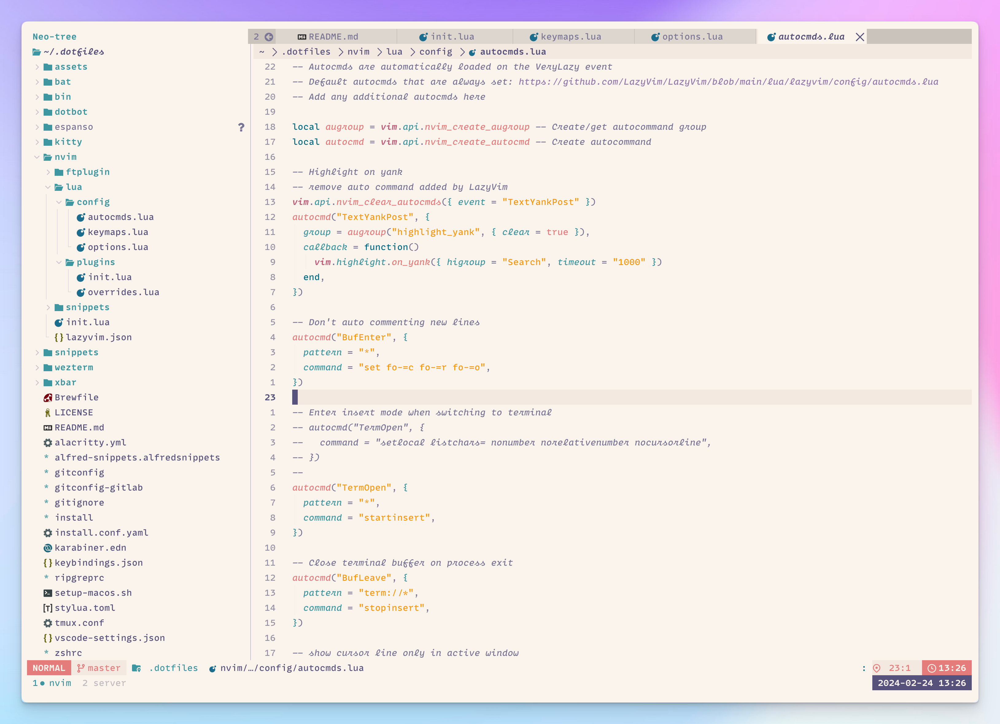

# Ammar's dotfiles



## Installation

1. `/bin/bash -c "$(curl -fsSL https://raw.githubusercontent.com/Homebrew/install/HEAD/install.sh)"`
2. `git clone git@github.com:AmmarCodes/dotfiles.git ~/.dotfiles`
3. `cd ~/.dotfiles && ./install`

I try to keep my [/uses](https://ammar.codes/uses) page up to date.

## Theme Switcher

A unified theme system that switches colors across all tools with a single command, inspired by [Omarchy](https://github.com/basecamp/omarchy).

### Usage

```bash
# Switch to a theme
theme-set catppuccin-frappe

# List available themes
theme-list

# Show current theme
theme-current

# Interactive picker (fzf)
theme-pick
```

One command updates: Ghostty, Neovim, tmux, Fish shell, yazi, Sketchybar, and Lazygit.

### Adding a New Theme

1. Create a new directory under `themes/<theme-name>/`
2. Add the required files:

| File             | Purpose                                 |
| ---------------- | --------------------------------------- |
| `colors.toml`    | Central color definitions (required)    |
| `neovim.lua`     | LazyVim plugin spec for the colorscheme |
| `tmux.tmux`      | tmux `@thm_*` variable definitions      |
| `sketchybar.lua` | Sketchybar color palette (Lua table)    |

1. `colors.toml` structure:

```toml
[meta]
name = "Theme Display Name"
variant = "dark"  # or "light"

[colors]
accent    = "#hex"
cursor    = "#hex"
foreground = "#hex"
background = "#hex"
selection_foreground = "#hex"
selection_background = "#hex"

# Terminal palette (color0-color15)
color0  = "#hex"   # black
color1  = "#hex"   # red
# ... color2 through color15

# Extended semantic colors (optional, for apps needing more)
surface0 = "#hex"
# ...
```

Templates in `themes/templates/` use `{{ key }}`, `{{ key_strip }}` (no `#`), and `{{ key_rgb }}` (decimal RGB) placeholders, which are substituted from `colors.toml` during `theme-set`.

### Architecture

```
themes/
  catppuccin-frappe/     # Per-theme directory
    colors.toml          # Central color definitions (source of truth)
    neovim.lua           # App-specific override
    tmux.tmux            # App-specific override
    sketchybar.lua       # App-specific override
  templates/             # Sed-processed templates
    ghostty.conf.tpl     # -> ghostty/theme.conf
    fish-theme.fish.tpl  # -> fish/theme.fish
    yazi-theme.toml.tpl  # -> yazi/theme.toml
    lazygit.yml.tpl      # -> lazygit/theme.yml
  active.tmux            # Symlink-like copy of current theme's tmux.tmux
  active-neovim.lua      # Copy of current theme's neovim.lua
```

## New setup

1. Dock
   - Clean up
   - Turn hiding on
   - Turn magnification on
2. Settings
   - Keyboard > Input Sources > Add needed layouts
   - Keyboard > Text > disable Add period with double-space
   - Keyboard > Shortcuts > Use keyboard navigation to move focus between controls
   - Keyboard > Shortcuts > Spotlight > Disable shortcuts
   - Keyboard > Shortcuts > Input Sources > Set Select the previous input source to Ctrl + Shift + Space
3. Install 1Password
4. Install work related projects (GDK & CDot)
5. Install Rosetta 2 `softwareupdate --install-rosetta`
6. Install dotfiles (this repo)
7. Setup Rectangle App (use spectacle shortcuts)
8. Configure Karabiner Element with `goku`
9. Download Zoom
10. Install [MonoLisa font](https://www.monolisa.dev)
11. Install Dropbox
12. Setup Alfred
13. Setup Slack
14. Setup Little Snitch
15. Setup Todoist
16. Setup Hand Mirror
17. Setup RubyMine
18. Setup Bartender
19. Run `upgrade` script to update nvim and tmux plugins
20. Setup iStat menus 6
21. Setup Flux
22. Setup Focus
23. Install and setup Obsidian
24. Setup xbar
25. Install Google Drive
26. Update Finder settings to align icons to grid
27. Setup Dash
28. Setup iMazing
29. Setup Homerow
